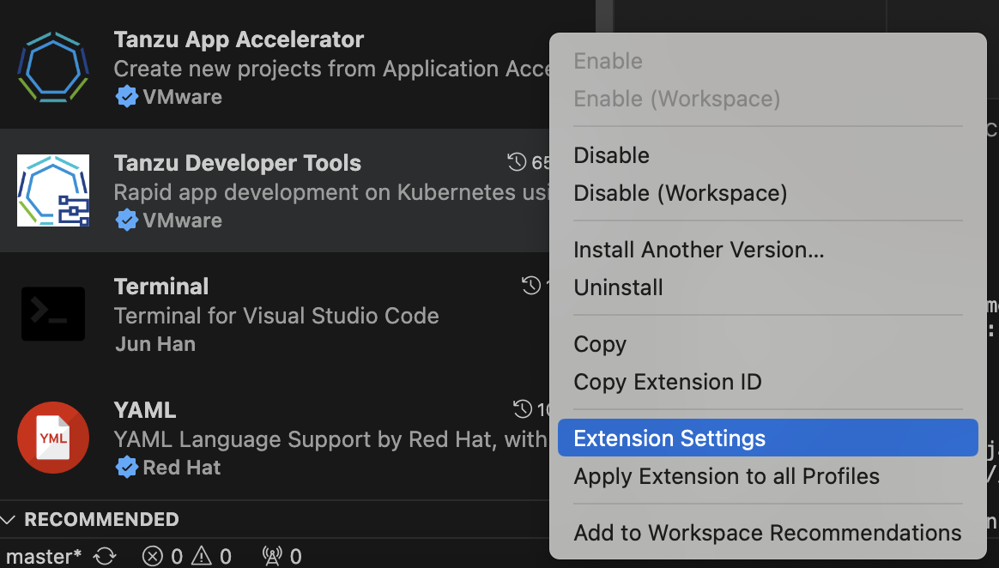
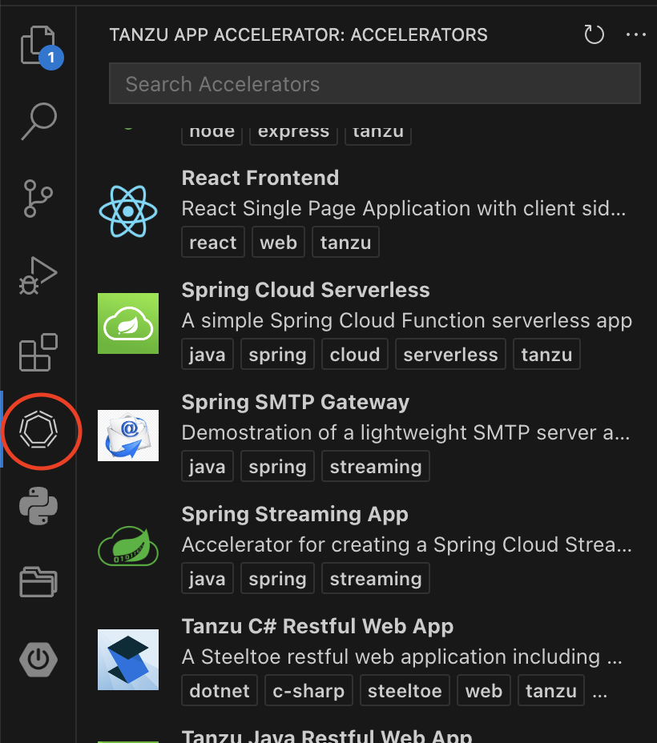
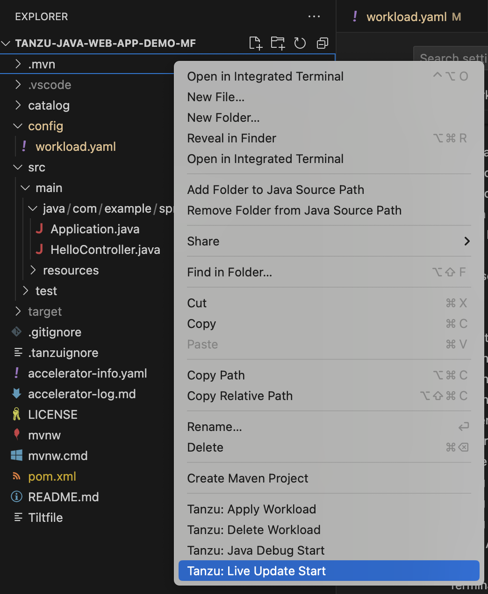
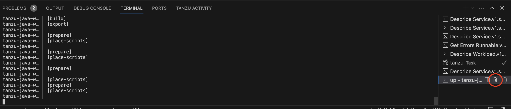
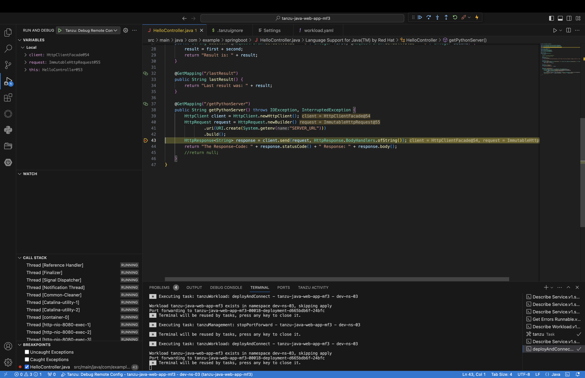
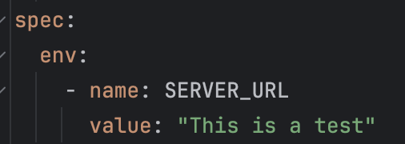
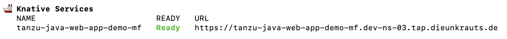
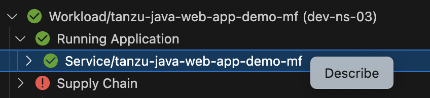
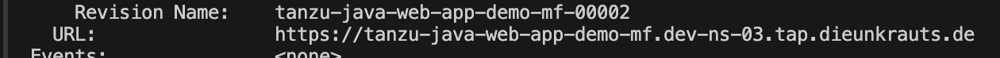

# TAP Developer Guide

Der folgende Guide beschreibt die Grundlagen in der Nutzung von TAP als Developer. Der Schwerpunkt dieses Guides liegt dabei in der Verwendung durch die IDE (VSCode).

- [TAP Developer Guide](#tap-developer-guide)
  - [Workflow als Developer](#workflow-als-developer)
  - [Setup](#setup)
  - [Einrichten der IDE (VSCode v17.7 oder höher)](#einrichten-der-ide-vscode-v177-oder-höher)
    - [Installation der Plugins](#installation-der-plugins)
    - [Plugin-Einstellungen in der IDE](#plugin-einstellungen-in-der-ide)
  - [Nutzung von TAP mithilfe der IDE](#nutzung-von-tap-mithilfe-der-ide)
    - [Verwendung der Accelerators und Erzeugen einer Workload](#verwendung-der-accelerators-und-erzeugen-einer-workload)
    - [Nutzung von Live Updates](#nutzung-von-live-updates)
    - [Nutzung von Java Debug](#nutzung-von-java-debug)
  - [Tipps](#tipps)
    - [Setzen von Umgebungsvariablen](#setzen-von-umgebungsvariablen)
    - [Adressen der Workloads im Cluster](#adressen-der-workloads-im-cluster)
  - [Fixes](#fixes)
    - [Label not found](#label-not-found)


## Workflow als Developer

Folgender Ablauf beschreibt einen möglichen Ablauf als Developer. Dabei ist zu beachten, dass viele weitere Abläufe möglich sind, beispielsweise bei der Nutzung von mehr als 2 Clustern und das dieser Stelle lediglich ein Beispiel dargestellt.  

- Erstellen eines neuen Projektes mithilfe eines Accelerators aus dem Tanzu Developer Portal
- Anlegen eines neuen Git Repositories für das Projekt
- Apply der Workload mit dem Git Repository als Quelle im Production Cluster
- Apply der Workload aus den lokalen Daten (über IDE bzw. Option --local-path) in Dev-Cluster
- Austesten von Änderungen (mit Verwendung von Tanzu Live Update) im Dev-Cluster
- Wenn Änderungen passen -> Push in Git Repo -> Änderungen werden automatisch im Production Cluster übernommen.

## Setup

Für das Nutzen eines TAP Clusters werden folgende Tools und Pugins benötigt:

- [VSCode installieren](https://code.visualstudio.com/download)
- [Docker installieren](https://docs.docker.com/desktop/install/windows-install/)
- [Kubectl installieren](https://kubernetes.io/docs/tasks/tools/install-kubectl-windows/)
- [Kubectl vSphere Plugin installieren](https://docs.vmware.com/en/VMware-vSphere/8.0/vsphere-with-tanzu-installation-configuration/GUID-0F6E45C4-3CB1-4562-9370-686668519FCA.html)
- [Tanzu-CLI installieren](https://tanzu.vmware.com/developer/learningpaths/inner-loop-dev-with-vmware-tanzu-application-platform/tanzu-cli-gs/#installing-tanzu)
- [Tilt installieren](https://docs.tilt.dev/install.html)

Zusätzlich empfiehlt es sich, für die Tanzu CLI weitere Plugins für TAP zu installieren. Diese beinhalten zum Beispiel das Accelerator Plugin, welches zum Nutzen und Erzeugen von Accelerators über die CLI benötigt wird. Der Befehl lautet dabei:

```sh
tanzu plugin install --group vmware-tap/default:v1.7.1      
```

## Einrichten der IDE (VSCode v17.7 oder höher)

### Installation der Plugins

Zur Nutzung von TAP durch die IDE werden folgende zwei Plugins benötigt:

- Tanzu Developer Tools
- Tanzu Application Accelerator

Beide Plugins sind direkt über den VSCode Marketplace erhältlich.
> **_HINWEIS_** Bei der Verwendung von VSCodium muss der Microsoft Marketplace ergänzt werden: https://www.flypenguin.de/2023/02/26/use-vscodium-with-microsofts-proprietary-marketplace/

### Plugin-Einstellungen in der IDE

Für das Verwenden der Accelerators mit dem Tanzu App Accelerator Plugin muss die URL zum Tanzu Developer Portal (ehemals Tanzu Application Platform Gui) hinterlegt werden. Dazu müssen in der Liste der Erweiterungen/Extensions mit einem Klick auf das Zahnrand beziehungsweise einem Rechtsklick auf <em>Tanzu App Accelerator</em> die Einstellungen des Plugins geöffnet werden.



In dem Feld unter <em>Tanzu Application Platform Gui URL</em> beziehungsweise <em>Tanzu Developer Portal</em> kann dann die URL zum Tanzu Developer Portal angegeben werden.  
Anschließend sollten über den Accelerator-Button am linken Rand der IDE die Accelerators angezeigt und aufgerufen werden können.

Zusätzlich kann man in den Einstellungen des Tanzu Developer Tools Plugins unter anderem folgende optionale Einstellungen vornehmen:

- Über <em>Local Path</em> kann der Pfad angegeben werden, der den Sourcecode enthält. Standardmäßig entspricht dieser dem Arbeitsverzeichnis.
- Über <em>Namespace</em> kann festgelegt werden, in welchem Namespace die Workload erzeugt werden soll. Standardmäßig wird die Workload in dem Namespace erzeugt, der in der Kubeconfig festgelegt ist.
- Das <em>Source Image</em> gibt den Namen und den Host des in der Registry zu speichernden Source Images an, falls der Local Source Proxy nicht eingerichtet sein sollte. In diesem Fall muss der User sich über den Befehl <em>docker login</em> bei dem entsprechenden Host einloggen um das Source Image pushen zu können. Der Push passiert automatisch beim Apply einer Workload, wenn ein Source Image mit angegeben wird. Das Source Image beinhaltet den Code und wird in späteren Schritten durch die Supply Chain verwendet um das Image zum Betrieb der Anwendung zu erzeugen.

## Nutzung von TAP mithilfe der IDE

### Verwendung der Accelerators und Erzeugen einer Workload

Durch das Einrichten des Tanzu Application Accelerator Plugins können in der IDE die Accelerator direkt verwendet werden, indem der entsprechende Button angeklickt wird.  



Alternativ lassen sich die Accelerator auch direkt über das TAP Developer Portal beziehen, indem die zugehörige URL direkt im Browser geöffnet wird. Zusätzlich lässt sich auch das Terminal nutzen um [mit der Tanzu CLI einen Accelerator zu nutzen](https://docs.vmware.com/en/VMware-Tanzu-CLI/1.1/tanzu-cli/tanzu-accelerator.html#tanzu-accelerator-generate-11).

Anschließend lässt sich das Projekt in der IDE verwenden. Um die Workload im TAP Cluster zu erzeugen und dadurch seine  Anwendung bereitzustellen, kann durch einen Rechtsklick im Projekt-Explorer der Befehl <em>Tanzu: Apply Workload</em> ausgeführt werden. Dabei wird die Workload in dem momentan ausgewählten Cluster und Namespace erzeugt, welche in der Kubeconig festgelegt sind. Wenn ein anderer Namespace ausgewählt werden soll als der, der in Kubeconfig angegeben ist, kann dieser in den Einstellungen des Tanzu Developer Tools Plugins festgelegt werden.
Der Stand des Apply-Prozesses lässt sich über das <em>Tanzu Activity</em> Panel einsehen, wenn im <em>Tanzu Workloads</em> Reiter im Explorer-Fenster der IDE die Workload ausgewählt wird. Alternativ lässt sich der Stand über folgenden Befehl im Terminal einsehen:

```sh
tanzu apps workload get WORKLOAD_NAME -n NAMESPACE 
```

Dabei wird auch am Ende der Ausgabe ein Befehl generiert um sich die Logs zu der Workload anzeigen zu lassen.

> **_HINWEIS_** Der Apply einer Workload durch die IDE bezieht immer Source Code aus der lokalen Maschine, unabhängig davon, ob in der workload.yaml ein Git Repository angegeben wird. Dies liegt daran, dass die IDE dem CLI-Befehl ein --local-path hinzfügt, was Werte/Einstellungen in der YAML-Datei überschreibt. Soll eine andere Quelle verwendet werden, so muss der Apply-Befehl über das Terminal ausgeführt werden.

> **_HINWEIS_** Wenn eine Python Anwendung bereitgestellt werden soll, wird zusätzlich eine Datei mit dem Namen <em>Procfile</em> benötigt, welche beschreibt welcher Befehl zum Start der Anwendung ausgeführt werden soll. Weitere Details finden sich [hier](https://devcenter.heroku.com/articles/procfile).

### Nutzung von Live Updates

Durch die Nutzung der Live Update Funktion kann Code im Cluster innerhalb weniger Sekunden aktualisiert werden, anstatt dass eine Workload erneut applied werden muss, was einige Minuten dauern kann. Dies ermöglicht ein schnelles Austesten von Änderungen am Code. Die Live Updates werden mithilfe von Tilt realisiert, weitere Informationen zu dem Tool finden sich [hier](https://docs.tilt.dev).  
Nachdem die IDE Plugins installiert sind genügt ein Rechtsklick im Explorer Fenster der IDE um Live Updates zu starten:  



Während das Live Update läuft, genügt ein Speichern der bearbeiteten Datei um ein Update der Anwendung im Container auszulösen. Dabei werden die Dateien aktualisiert, die durch <em>sync</em> in der Tiltfile Datei erfasst werden, die für das Live Update benötigt wird. Sollen Dateien von der Aktualisierung exkludiert werden, kann eine .tiltignore mit den zu ignorierenden Dateien im gleichen Verzeichnis wie die Tiltfile Datei erstellt werden. Dabei verhält sich .tiltignore wie beispielsweise .gitignore, weitere Informationen finden sich [hier](https://docs.tilt.dev/file_changes.html). Zusätzlich muss in der Tiltfile die aus den Accelerators stammt beachtet werden, dass der Ziel-Namespace dem der Umgebungsvariable <em>NAMESPACE</em> entspricht und ansonsten <em>default</em> ist. Grundsätzlich wird beim Start des Live Updates in VSCode gefragt, welcher Namespace verwendet werden soll bzw. der passende Namespace automatisch ausgewählt, ansonsten empfiehlt es sich, die Tiltfile entsprechend anzupassen. Beenden lässt sich das Live Update in der IDE über den Terminalreiter durch das Terminieren des <em>up</em> Terminals:  


### Nutzung von Java Debug

Durch <em>Tanzu: Java Debug</em> kann eine Anwendung im Cluster auf die gleiche Art wie lokal durch die IDE. Dazu müssen lediglich Breakpoints an der entsprechenden Stelle gesetzt werden und über einen Rechtsklick im Projekt-Explorer Fenster <em>Tanzu: Java Debug Start</em>. Anschließend stoppt die Anwendung im Container an der Stelle an der ein Breakpoint gesetzt wurde und zeigt in der IDE Debug-Informationen:  


Das Debugging lässt sich beenden, indem man in der Debug Leiste (in der auch die Anwendung nach dem Stoppen durch einen Breakpoint fortgesetzt werden kann) dieses stoppt/terminiert.
Das Debugging kann parallel zu einem Live Update genutzt werden.

## Tipps

In diesem Abschnitt finden sich einige Tipps zum Arbeiten mit den Workloads.

### Setzen von Umgebungsvariablen

In der workload.yaml können Umgebungsvariablen definiert werden, die dann anschließen durch die Anwendung verwendet werden können. Angeben werden können die Umgebungsvariablen als Name/Value Paare unter spec.env:  



### Adressen der Workloads im Cluster

Durch Kubernetes werden automatisch DNS Einträge für Services und Pods erzeugt, wodurch nicht die exakte IP bekannt sein muss. Für eine Workload setzt sich die Adresse aus dem Namen der Workload und dem Namespace zusammen, gefolgt von <em>svc.cluster.local</em> und dem Port der Anwendung.  
Angenommen, die Workload heißt <em>my-app</em> und befindet sich im Namespace <em>dev-ns-03</em> (beides kann in der workload.yaml festgelegt werden), dann lautet die URL innerhalb des Clusters <em>my-app.dev-ns-03.svc.cluster.local:8080</em> bzw. <em>http://my-app.dev-ns-03.svc.cluster.local:8080</em> (je nach verwendetem Protokoll).
Falls die Workload von außerhalb des Cluster zugänglich ist, lässt sich mit folgendem Befehl die URL unter <em>Knative Services</em> finden:

```sh
tanzu apps workload get WORKLOAD_NAME -n NAMESPACE 
```



Alternativ erhält man die URL über die IDE indem man dort im Workloads Panel (Voraussetzung dafür ist das Tanzu Developer Tools Plugin) die entsprechende Workload auswählt und anschließend im Tanzu Activity Panel mit Rechtsklick einen Describe auf den Service unter <em>Running Application</em> ausführt.



## Fixes

### Label not found

Möglicherweise kann eine Workload nicht erzeugt werden, weil durch den Selektor aus einem Label in der workload.yaml keine passende Supply-Chain im Cluster gefunden werden kann. Der Fehler (und dementsprechend der problematische Selektor) kann in der IDE über das Activity Panel angezeigt werden, indem ein <em>describe</em> durchgeführt wird (unter <em>Workload/Supply Chain/Runnable/WORKLOAD_NAME</em>). Anschließend sollten folgende Schritte unternommen werden:

- In workload.yaml entsprechende Labels unter metadata.labels anpassen, bzw. sogar entfernen
- Operator darauf hinweisen, ggf. muss Supply Chain angepasst werden.
