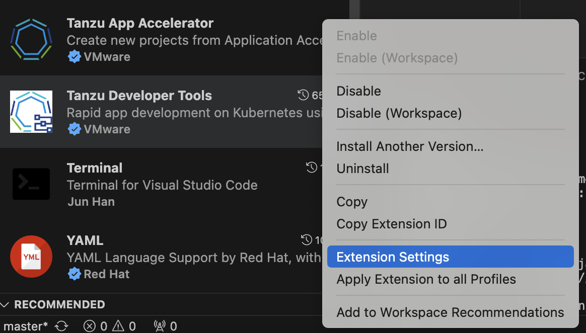
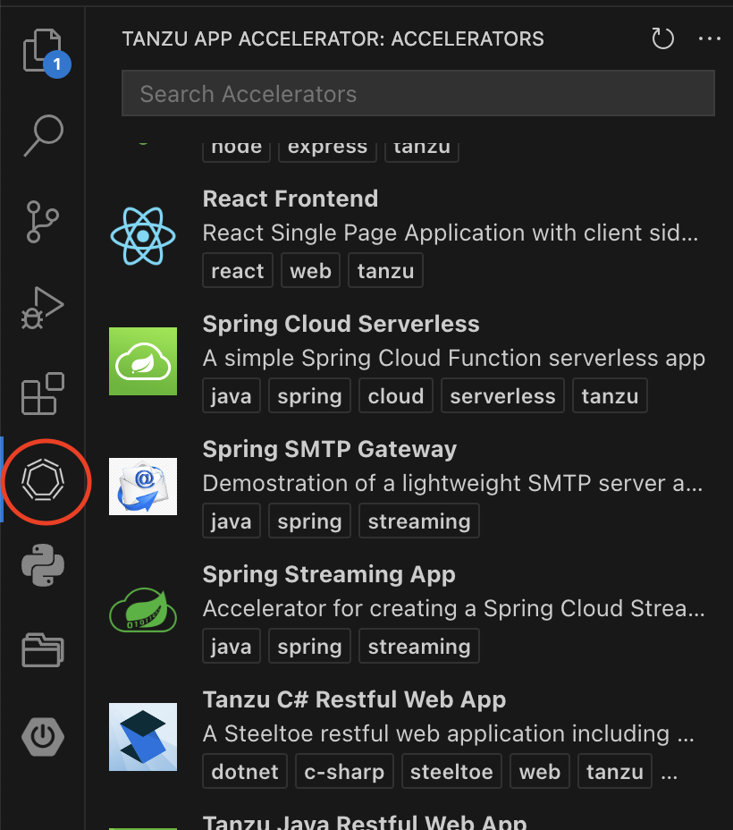
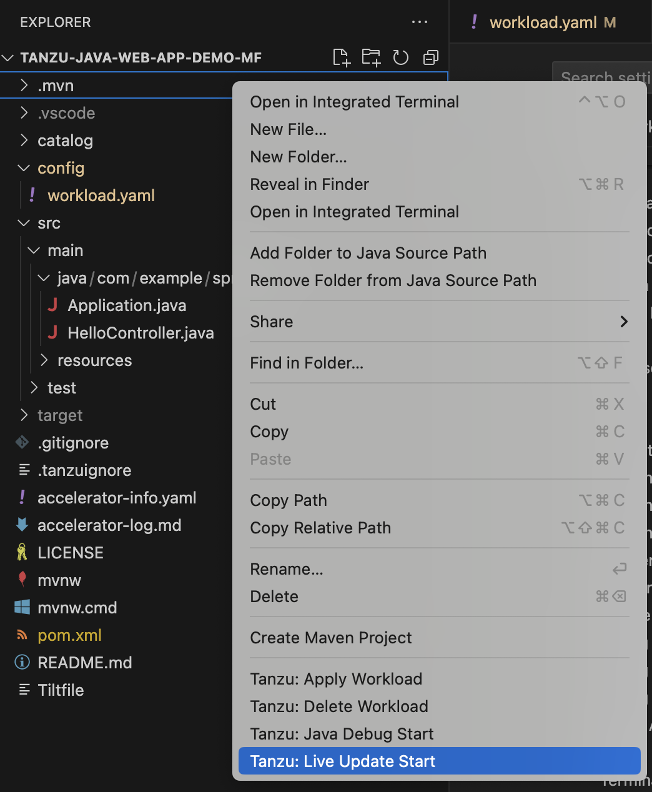
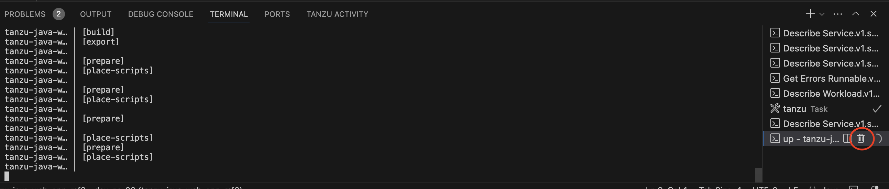
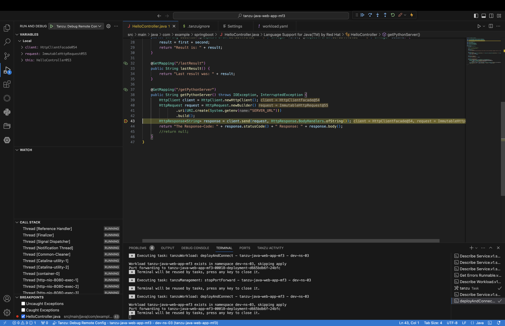
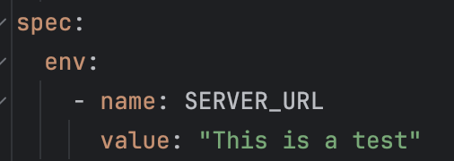
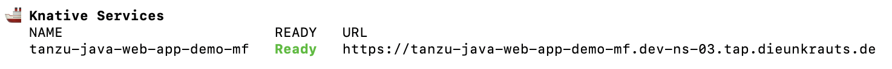
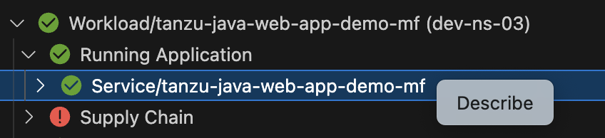
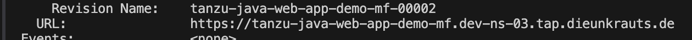

# TAP Developer Guide

The following guide covers the basics for using TAP as a developer. This guide focuses the usage through the IDE (VSCode).

- [TAP Developer Guide](#tap-developer-guide)
  - [Workflow as a Developer](#workflow-as-a-developer)
  - [Setup](#setup)
  - [Setting up the IDE (VSCode v17.7 or higher)](#setting-up-the-ide-vscode-v177-or-higher)
    - [Installing the Plugins](#installing-the-plugins)
    - [Plugin-Settings inside the IDE](#plugin-settings-inside-the-ide)
  - [Using TAP with the IDE](#using-tap-with-the-ide)
    - [Using the accelerator and creating a workload](#using-the-accelerator-and-creating-a-workload)
    - [Using Live Updates](#using-live-updates)
    - [Using Java Debug](#using-java-debug)
  - [Tips](#tips)
    - [Setting Environment Variables](#setting-environment-variables)
    - [Workload Addresses in the Cluster](#workload-addresses-in-the-cluster)
  - [Fixes](#fixes)
    - [Label not found](#label-not-found)


## Workflow as a Developer

The following sequence describes one possible sequence as a developer. Note that this serves as a simple example, there
are many other different workflows.

- Setting up a new project by using an accelerator from the Tanzu Developer Portal
- Creating a new Git repository for the project
- Applying the workload in a production cluster while using the Git repository as source
- Applying the workload from local files (via IDE or the option _--local-path_) in the Dev-Cluster
- Testing out changes (while using Tanzu Live Update) in the Dev-Cluster
- If changes work/are correct -> Push in Git repository -> Changes will be applied to the production cluster automatically

## Setup

For using/interacting with a TAP cluster, the following tools and plugins are required:

- [VSCode](https://code.visualstudio.com/download)
- [Docker](https://docs.docker.com/desktop/install/windows-install/)
- [Kubectl](https://kubernetes.io/docs/tasks/tools/install-kubectl-windows/)
- [Kubectl vSphere Plugin](https://docs.vmware.com/en/VMware-vSphere/8.0/vsphere-with-tanzu-installation-configuration/GUID-0F6E45C4-3CB1-4562-9370-686668519FCA.html)
- [Tanzu-CLI](https://tanzu.vmware.com/developer/learningpaths/inner-loop-dev-with-vmware-tanzu-application-platform/tanzu-cli-gs/#installing-tanzu)
- [Tilt](https://docs.tilt.dev/install.html)

It is also recommended to install additional plugins for the Tanzu-CLI for using TAP. These include, for example, 
the accelerator plugin, which is required to use and create accelerators via the CLI.
The command is:

```sh
tanzu plugin install --group vmware-tap/default:v1.7.1      
```

## Setting up the IDE (VSCode v17.7 or higher)

### Installing the Plugins

The following two plugins are required for using TAP through the IDE:

- Tanzu Developer Tools
- Tanzu Application Accelerator

Both plugins can be found in the VSCode Marketplace.

> **_NOTE_** If VSCodium is used, the Microsoft Marketplace has to be added:
> <https://www.flypenguin.de/2023/02/26/use-vscodium-with-microsofts-proprietary-marketplace/>

### Plugin-Settings inside the IDE

In order to use the accelerators through the Tanzu App Accelerator Plugin, the URL to the Tanzu Developer Portal (formerly known as _Tanzu Application Platform GUI_) has to be set.
To do this, the plugin settings must be opened in the list of extensions by clicking on the gear icon or right-clicking on _Tanzu App Accelerator_



The URL to the Tanzu Developer Portal can be set through the input field under _Tanzu Application Platform Gui URL_ or _Tanzu Developer Portal_.
Afterwards the accelerators should be visible and accessible through the _Accelerator_ button on the left hand side of the IDE window.

In addition, the following optional settings can be made in the Tanzu Developer Tools plugin settings:

- Through _Local_ the path containing the sourcecode can be set. By default, this is set to the project directory.
- Through _Namespace_ the namespace, in which the workload is going to be applied, can be set.
- The _Source Image_ sets the name and host the source image that's going to be saved in the registry, if the local source proxy is not set up. In this case, the user has to login to the host via _docker login_ in order to push the source image. The push happens automatically when applying a workload if a source image is provided. The source image contains the code and is used by the supply chain in order to create the actual image for running the application

## Using TAP with the IDE

This section covers how to interact with a TAP cluster through the IDE and additional functiony provided through the plugins like debugging a Java application that is running in the cluster.

### Using the accelerator and creating a workload

By setting up the Tanzu Application Accelerator Plugin. the accelerators can be used by clicking on the corresponding button inside the IDE.



Alternatively, the accelerator can be used directly through the TAP Developer Portal by accessing the corresponding URL through the browser. Additionally, the terminal can be used in order to [use an accelerator through the Tanzu-CLI](https://docs.vmware.com/en/VMware-Tanzu-CLI/1.1/tanzu-cli/tanzu-accelerator.html#tanzu-accelerator-generate-11).

Afterwards, the project can be used in the IDE. In order to create a workload in the TAP Cluster and therefore provide a application, the command _Tanzu: Apply Workload_ can be executed by right-clicking inside the project-explorer window. The workload is then created in the cluster and namespace that is currently set in the Kubeconfig. If a namespace other than the one specified in Kubeconfig is to be selected, this can be specified in the settings of the Tanzu Developer Tools plugin. The current status of the apply process can be seen through the _Tanzu Activity_ panel if the workload is selected in the _Tanzu Workloads_ tab in the Explorer window of the IDE. Alternatively, the status can be viewed through the following terminal command:

```sh
tanzu apps workload get WORKLOAD_NAME -n NAMESPACE 
```

This also provides a command at the end of the output which can be used to view the logs of the workload.

> **_NOTE_** Applying a workload through the IDE always uses the local source code, regardless of whether a Git repository was provided in the workload.yaml. This is because the IDE appends a _--local-path_ to the CLI command that overrides settings/values coming from the YAML file. If a differenct source is to be used, the apply command must be executed through the terminal.

> **_NOTE_** If the application to be provided written in Python, a file named _Procfile_ is required, which describes which command to execute when starting the application. More details can be found [here](https://devcenter.heroku.com/articles/procfile).

### Using Live Updates

By using the live update function, code in the cluster can be updated within a few seconds instead of having to reapply a workload, which can take several minutes.
This allows for a faster testing of code changes. Live Updates are realized through Tilt, more information about this tool can be found [here](https://docs.tilt.dev).
After the IDE plugins have been installed, simply right-click in the Explorer window of the IDE to start Live Updates:



While the live update is running, saving the edited file is sufficient to trigger an update of the application in the container. This updates files that are selected in the _sync_ section in the _Tiltfile_, which is a required file for doing Live Updates.
If certain files have to be exluded from the update, a _.tiltignore_ file (in which the files to be ignored are specified) can be created in the same directory as the Tiltfile.
_.tiltignore_ behave similar to _.gitignore_, more information can be found [here](https://docs.tilt.dev/file_changes.html). In addition, it must be taken into account in the tilt file from the accelerators that the target namespace corresponds to that of the environment variable _NAMESPACE_ and is otherwise the _default_.
When starting the Live Update in VSCode, you are always asked which namespace should be used or the appropriate namespace is automatically selected, otherwise it is recommended to adjust the tilt file accordingly. The Live Update can be stopped in the IDE via the temrinal tab by terminating the _up_ terminal:



### Using Java Debug

_Tanzu: Java Debug_ enables debugging a Java application inside the cluster the same way as debugging a Java application running locally.
All you have to do is set breakpoints at the appropriate point and right-click in the Project Explorer window _Tanzu: Java Debug Start_. The application then stops in the container at the point where a breakpoint was set and displays debug information in the IDE:



Debugging can be ended by stopping/terminating it in the debug bar (in which the application can also be continued after being stopped by a breakpoint).
Debugging can be used in parallel with a live update.

## Tips

This section covers some tips for working with workloads.

### Setting Environment Variables

In the _workload.yaml_ environment variables can be set which then can be used by the application. The environment variables can be specified as name/value pairs under spec.env:  



### Workload Addresses in the Cluster

Kubernetes automatically creates DNS entries for services and pods, so that knowing the exact IP isn't required. For a workload, the address is made up of the name of the workload and the namespac, followed by _svc.cluster.local_ and the port of the application.
Assuming the workload is named _my-app_ and created in the namespace _dev-ns-03_ (both can be set in the workload.yaml), the URL within the cluster will be _my-app.dev-ns-03.svc.cluster.local:8080_ or _http://my-app.dev-ns-03.svc.cluster.local:8080_ (depending on the protocol used). If the workload is accessible from outside of the cluster, the URL can be acquired through the following command under _Knative Services_:

```sh
tanzu apps workload get WORKLOAD_NAME -n NAMESPACE 
```



Alternatively, you can obtain the URL via the IDE by selecting the corresponding workload in the Workloads Panel (prerequisite for this is the Tanzu Developer Tools Plugin) and then right-clicking on the service under _Running Application_ in the Tanzu Activity Panel.




## Fixes

This section covers issues that can occur when getting started with TAP.

### Label not found

It is possible that a workload cannot be created because the selector from a label in workload.yaml cannot find a suitable supply chain in the cluster. The error (and therefore the selector causing problems) can be seen in the IDE through the Activity Panel by doing a _Describe_ (under _Workload/Supply Chain/Runnable/WORKLOAD_NAME_). The following steps should then be taken:

- Modify/delete the problematic labels in the workload.yaml under _metadata.labels_
- Inform operator, supply chain may need to be adjusted